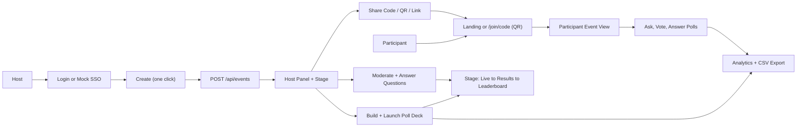

# Loom Project Features

## Executive Summary

Loom is an internal live audience-engagement platform for company meetings, all-hands, town halls,
hackathons, onboarding sessions, and retrospectives. It lets a host create an event in one click,
share an access code / QR / join link, collect audience questions, run live polls and quizzes,
drive a projector stage, and review (and export) engagement analytics after the session.

The project is a Next.js 16 application with React 19, TypeScript, Prisma 7, SQLite, NextAuth, and
Socket.IO. Business data is stored in SQLite through Prisma; live room updates are broadcast with
Socket.IO through a custom Node server (`server.ts`). It ships with a Render blueprint
([`render.yaml`](./render.yaml)) for deployment as a long-running Node web service with a persistent
disk.

Loom implements the acceptance criteria for the four core interaction types (poll, word cloud, quiz,
Q&A), plus a full event lifecycle (draft → live → ended → archived), a host-driven projector stage,
configurable quiz scoring, host-answered questions, a per-event anonymity policy, and image upload.
The deliberate demo-oriented shortcuts that remain are mocked SSO, single-instance SQLite
persistence, and a few un-hardened authorization checks (see **Security**).

## Product Purpose

Loom solves a common meeting problem: participants want a low-friction way to ask questions and react
live, while organizers need moderation, structured audience input, and a clean presenter display.

The product supports four main user types:

- **Host / organizer**: creates events, configures rooms and policy, builds the poll deck, moderates
  and answers Q&A, drives the stage, and reviews analytics.
- **Participant**: joins quickly by code, link, or QR; asks questions, upvotes, and answers polls.
- **Speaker / presenter**: drives the projector stage view, which shows the live poll, results,
  top/highlighted questions, and leaderboards.
- **IT / administrator**: expects access control through enterprise authentication. In this
  hackathon implementation that is represented by a mock SSO flow.

## Platform Flow



The main runtime loop is:

1. Hosts and participants use Next.js pages under `app/`.
2. Pages call REST-style route handlers under `app/api/`.
3. API routes persist durable changes through Prisma and SQLite.
4. After important writes, clients emit Socket.IO events.
5. `server.ts` broadcasts those events to all clients joined to the same event room.
6. Receiving clients update local React state or refetch the affected API endpoint.

## Business Features

### 1. Event Creation (frictionless)

Business value: organizers can spin up an interaction space in one click, with no setup form to fill in.

User flow:

1. Host signs in at `/login` (credentials, registration, or mock company SSO).
2. From the home page or the `/events` dashboard, the host clicks **Create** (a name is optional).
3. The page sends `POST /api/events`.
4. The backend creates the event (status **draft**), generates a unique access code, and creates a
   default `Main` room; the host lands on the **host panel**. Clicking **Go Live** makes it joinable
   and ready to share.

Technical implementation:

- There is **no `/create` page** — creation is a single action from `app/page.tsx` / `app/events/page.tsx`.
- `app/api/events/route.ts` validates the session, requires `session.user.role === "host"`, generates
  a unique access code, and creates the event. The name defaults to `"Live session"` when omitted; the
  schema's `startDate`/`endDate` default to "now" (they are not surfaced in the UI).
- `lib/generate-code.ts` generates six-character codes using unambiguous uppercase letters and digits.
- Event policy (passcode, moderation, anonymity) is set later from the host **Settings** card, not at
  creation time.

### 2. Quick Join For Participants (code / link / QR)

Business value: participants join from their phones in seconds, with nothing to install.

User flow:

1. Participant enters an event code on `/`, opens `/join/[code]`, or **scans the stage QR code**.
2. If unauthenticated, the app asks for a display name and signs the user in through the guest provider.
3. If the event has a passcode, the participant enters it.
4. The app calls `POST /api/events/join`.
5. On success, the participant lands on `/event/[id]`.

Technical implementation:

- `app/page.tsx` handles landing-page code entry; `app/join/[code]/page.tsx` handles direct links / QR.
- `components/event-qr.tsx` renders a join QR client-side (`qrcode.react`); it appears on the stage
  header and on the host panel's Access Code card (with a PNG download). The QR encodes
  `${origin}/join/CODE`, so it points at whatever host serves the stage.
- `app/api/events/join/route.ts` looks up events by uppercase access code, checks the optional
  passcode, and rejects joins unless the event is `live`.
- `lib/auth.ts` defines a `guest` credentials provider that creates a participant user with `isGuest: true`.

### 3. Asking Questions And Voting (with anonymity policy)

Business value: participants surface the most important questions without interrupting, and leaders
prioritize answers by audience demand.

User flow:

1. Participant opens `/event/[id]` and selects a room if multiple rooms exist.
2. Participant writes a question (max 300 characters).
3. If the event allows it, the participant can check **Ask anonymously**; if the host has set
   **Names required**, questions are always attributed and the checkbox is replaced by a note.
4. The app posts to `POST /api/events/[id]/questions`.
5. The question appears immediately (or as pending to its author, if moderation is on).
6. Participants upvote / un-vote; the list is sorted by vote count.

Technical implementation:

- `app/event/[id]/page.tsx` renders the form and vote controls, conditioned on `event.allowAnonymous`.
- `app/api/events/[id]/questions/route.ts` enforces the policy server-side: if anonymity is disallowed,
  the question is attributed regardless of what the client requested.
- `app/api/events/[id]/questions/[questionId]/vote/route.ts` toggles votes; `Vote` is unique on
  `(questionId, userId)`.
- Socket events `question:new` and `question:vote` broadcast new questions and vote-count changes.

### 4. Live Question Moderation And Host Answers

Business value: hosts keep the shared screen useful and safe, and can answer questions in writing so
the answer reaches every phone and the export.

User flow:

1. Host toggles **Question moderation** on (from the Settings card — any time, not just at creation).
2. Submitted questions are stored as `pending`; the host reviews them on the host panel.
3. Host approves / rejects, **highlights** a question to push it full-screen on the stage, or archives it.
4. For any approved (or, in unmoderated mode, any) question, the host can **type an answer**; it shows
   on phones as "HOST ANSWERED" and is included in the CSV export.

Technical implementation:

- `Question.status` supports `pending`, `approved`, `highlighted`, `archived`, `rejected`.
- `Question.answer` / `Question.answeredAt` store the host's written answer.
- `app/api/events/[id]/questions/pending/route.ts` lists pending questions for the event owner.
- `app/api/events/[id]/questions/[questionId]/moderate/route.ts` updates status (owner only).
- `app/api/events/[id]/questions/[questionId]/answer/route.ts` sets/clears the answer (owner only).
- Socket events `question:status` and `question:answered` propagate moderation and answers.

### 5. Polls, Word Clouds, And Quizzes (with a managed deck)

Business value: hosts turn one-way presentations into interactive moments and prepare a full deck of
questions ahead of time.

User flow:

1. Host opens the **Polls** tab in `/event/[id]/host`.
2. Host creates a poll: **Multiple Choice**, **Word Cloud**, or **Quiz** (options entered one per line).
3. For quizzes, the host marks the correct option, sets a timer, and chooses the **scoring** (see §8).
4. Host can attach an **image** (drag a file, browse, or paste a public URL).
5. Drafts form a **deck**: the host can **reorder** (▲▼), **edit**, or **delete** them before launch.
6. Host launches a poll; it becomes the one active poll for that room, on phones and the stage.

Technical implementation:

- `Poll.type` is `multiple_choice` | `word_cloud` | `quiz`; `Poll.status` is `draft` | `active` | `closed`;
  `Poll.order` sequences the deck.
- Images are shrunk **client-side** to a compact JPEG **data URL** (`fileToDownscaledDataUrl`,
  max 1280px) and stored inline in `Poll.imageUrl` — no upload service or blob storage. They render on
  both the participant and stage views.
- `app/api/events/[id]/polls/route.ts` lists (ordered) and creates polls.
- `app/api/events/[id]/polls/[pollId]/route.ts`: `PATCH` status; `PUT` edits a **draft** in place
  (replacing options); `DELETE` removes a poll (owner only).
- `app/api/events/[id]/polls/reorder/route.ts` persists deck order (owner only).
- `app/api/events/[id]/polls/[pollId]/correct/route.ts` stores a quiz's correct answer.
- Activating a poll closes any other active poll in the same room.

### 6. Real-Time Poll Participation

Business value: participants see activities appear at the right moment without refreshing.

User flow:

1. Host launches a poll → host client emits `poll:activated` → Socket.IO broadcasts to the event room.
2. Participant view fetches the active poll and submits an answer.
3. The API records the response (one per user for choice/quiz; word clouds allow many).
4. The participant sees a submitted / quiz-result / locked state; the stage updates as responses arrive.
5. When the host advances to the **results beat**, the poll is closed server-side (locking late answers)
   and `poll:results` pushes the final bars (+ this question's scores) so every surface mirrors them.

Technical implementation:

- `server.ts` creates a Socket.IO server at `/api/socketio`; `lib/socket.ts` is the singleton client.
- `app/event/[id]/page.tsx` listens for `poll:activated`, `poll:response`, `poll:closed`, `poll:results`.
- `app/api/events/[id]/polls/active/route.ts` returns the active poll (with `imageUrl`, `points`,
  response counts, and word-cloud aggregation).
- `app/api/events/[id]/polls/[pollId]/respond/route.ts` records responses and computes quiz score.
- `PollResponse` uses a non-unique `(pollId, userId)` index; the API enforces one response per user
  for choice/quiz polls while letting word clouds grow.

### 7. The Stage (host-driven projector view)

Business value: the audience sees a clean large-format display that the host drives directly from the
projector, with no second laptop required.

User flow:

1. Host opens `/event/[id]/present?control=1` on the projector — chrome-free, with a slim header
   carrying the event name, the **join code**, and a **QR code**.
2. A bottom **control rail** drives a two-beat deck: each poll runs **Live → Results**, and **Next**
   walks the beats (its label reflects what it will do: Start / Results / Next).
3. On the results beat, the correct answer is revealed on the bars and this question's scoreboard
   appears beside it. The **Overall** leaderboard is a non-destructive overlay — raise it on any beat,
   hide it, and you are back where you were.
4. Highlighting a question from the host panel pushes it full-screen on the stage.
5. The host can navigate back to the host panel from the stage; an ended event shows post-event nav.

Technical implementation:

- `app/event/[id]/present/page.tsx` renders the stage; `?control=1` enables the presenter rail.
- It listens for `question:*`, `poll:activated`, `poll:response`, `poll:closed`, `poll:results`,
  and `poll:leaderboard` (which carries a `title` so "This Question" vs "Overall" is labeled correctly,
  and a `hide` flag for the overlay).
- Choice/quiz bars and the word cloud are shared renderers reused by the live and results beats.

### 8. Quiz Gamification, Configurable Points, And Leaderboards

Business value: quizzes reward correctness and (optionally) speed, then turn results into friendly
competition — and the host controls how much each question is worth.

User flow:

1. Host creates a quiz, sets a timer, marks the correct answer, and picks the **scoring**:
   - **Speed bonus** — a correct answer earns **50–100%** of the question's points, scaled by time left.
   - **Flat** — a correct answer earns **exactly** the question's points, regardless of speed.
2. Host sets the **points** for the question (default 1000).
3. Participants answer before the timer ends; the backend scores server-side.
4. Participants see whether they were correct and the points earned; on the stage, the host reveals the
   answer and shows the leaderboard.

Technical implementation:

- `Poll.timerSeconds`, `Poll.points` (default 1000), and `Poll.scoreMode` (`speed` | `flat`) configure
  scoring. Defaults reproduce the original behavior exactly.
- `app/api/events/[id]/polls/[pollId]/respond/route.ts` computes the score, anchored to the poll's
  `activatedAt` so a page refresh cannot reset the timer:

  ```text
  speed: score = round(points * (0.5 + 0.5 * timeRemaining / total))
  flat:  score = points          (for a correct answer; 0 otherwise)
  ```

- `app/api/events/[id]/polls/[pollId]/leaderboard/route.ts` aggregates scores. With `?single=1` it
  returns **this question's** scores (a standalone-tournament view); otherwise it sums across all quiz
  polls in the room (the cumulative leaderboard).
- Socket event `poll:leaderboard` pushes leaderboard state (with its `title`) to the stage.

### 9. Multi-Room Support

Business value: one event can contain parallel tracks or breakouts under a single access code.

- `Room` belongs to `Event`; `Question` and `Poll` belong to `Room`, not directly to `Event`.
- `components/room-switcher.tsx` renders room tabs and optional room creation.
- `app/api/events/[id]/rooms/route.ts` lists and creates rooms.
- Pages pass `roomId` to question/poll/leaderboard/analytics APIs; poll activation closes active polls
  only within the same room. Socket broadcasts are event-wide, and clients filter by `roomId`.

### 10. Analytics Dashboard And CSV Export

Business value: organizers review engagement and export raw data for follow-up.

User flow:

1. Host opens `/event/[id]/analytics` (room-selectable); results are labeled `LIVE · IN PROGRESS` vs `FINAL`.
2. The dashboard shows participant count, questions, upvotes, poll responses, and engagement rate.
3. Host clicks **Export to CSV**.

Technical implementation:

- `app/api/events/[id]/analytics/route.ts` computes metrics and returns questions (with host `answer`),
  poll summaries, the **leaderboard**, and per-response rows.
- `app/event/[id]/analytics/page.tsx` renders the dashboard and builds the CSV client-side (Blob +
  object URL). The export covers questions (incl. the host's answer), poll options, the quiz
  leaderboard, **and per-response rows** (participant, answer, correctness, points, time) — so a
  user can see who answered what.

### 11. Enterprise SSO Authentication (mocked)

Business value: internal tools should restrict event creation to authorized company users.

- `lib/auth.ts` configures NextAuth (JWT) with `sso` (mock), `guest`, and `credentials` providers.
- `lib/sso.ts` derives a display name from the email local part.
- `app/api/auth/register/route.ts` creates email/password host users (bcrypt-hashed).
- `app/api/events/route.ts` requires a `host` role to create events.
- This is a stable mock suitable for the hackathon; it does **not** implement real OAuth2 / Azure AD,
  corporate redirects, domain allow-listing, or route-level enterprise enforcement. Guests can join.

### 12. Event Lifecycle And Settings

Business value: one code maps to one meeting; stale events stop accepting joins; analytics finalize on end.

User flow:

1. A new event starts as a **draft** (not joinable); the host clicks **Go Live**, then shares the code.
2. The host runs the deck and Q&A; the **Settings** card toggles moderation, the anonymity policy, the
   passcode, and the event name at any time.
3. The host clicks **End Event** → status `ended`, participants see a "session ended" screen in real
   time, and further joins are rejected. The host can **Reopen** or **Archive** (and unarchive).

Technical implementation:

- `Event.status` is `draft` | `live` | `ended` | `archived`; `Event.endedAt` records the end time.
- `app/api/events/[id]/route.ts`: `GET` returns event + rooms + host name; `PATCH` validates lifecycle
  transitions **and** edits `name` / `passcode` / `moderationEnabled` / `allowAnonymous` (owner only);
  `DELETE` removes the event (owner only, cascade).
- `app/api/events/join/route.ts` rejects non-`live` joins with a status-aware message.
- `server.ts` relays `event:status`; participant and stage views render overlays and refresh on go-live.
- `app/events/page.tsx` lists events grouped by status, with delete.

## Technical Architecture

### Frontend

Next.js App Router pages under `app/`, mostly client components using React local state, `useEffect`,
and `fetch`. No global state library; each page owns its loading / room / form state.

Page routes: `/` (host-first landing + join), `/login`, `/events` (dashboard), `/join/[code]`,
`/event/[id]` (participant), `/event/[id]/host` (host panel), `/event/[id]/present` (stage),
`/event/[id]/analytics`. There is no `/create` page.

### Backend APIs

Route handlers under `app/api/` validate sessions where needed, read/write through Prisma, and return
JSON. Realtime broadcasting is not done by API routes directly; after a successful call, the client
emits a Socket.IO event that `server.ts` fans out.

### Persistence

Prisma 7 with SQLite and `@prisma/adapter-better-sqlite3`.

- `lib/db.ts` creates the Prisma client; `prisma.config.ts` supplies `DATABASE_URL` (via dotenv).
- `prisma/schema.prisma` defines users, events, rooms, questions, votes, polls, options, responses.
- The generated client lives at `app/generated/prisma` and is **git-ignored** — it must be regenerated
  on each install/build (`prisma generate`, wired into `postinstall` and the `build` script).
- `prisma/seed.ts` idempotently seeds a fallback host (`host@loom.demo`).

### Realtime

`server.ts` wraps Next.js in a custom HTTP server and attaches Socket.IO at `/api/socketio`. Socket.IO
is a **fan-out layer only**: it does not persist data or compute business rules — it broadcasts
notifications, and clients then update local state or refetch the relevant REST endpoint. The custom
server is **not** hot-reloaded; restart `npm run dev` after editing it.

### Visual identity

Loom ships a single committed visual identity — the neon look. The earlier multi-skin switcher has
been **retired**: `components/theme-provider.tsx` hard-codes the theme (`FIXED_THEME = "arcade"`), and
`components/skin-switcher.tsx` is effectively dead code (a cleanup candidate). `app/globals.css` holds
the CSS variables; `components/app-header.tsx` uses the same tokens.

### Deployment

The app deploys as a **Render Web Service** — a long-running Node process (required for the WebSocket
server and SQLite writes; a static site or serverless functions would not work).

- [`render.yaml`](./render.yaml) provisions the service (`runtime: node`, plan `starter`, region
  `frankfurt`), a **1 GB persistent disk** at `/var/data` for the SQLite file, and the env vars.
- Build: `npm ci --include=dev && npx prisma generate && npm run build`.
- Start: `npx prisma migrate deploy && (npx tsx prisma/seed.ts || true) && npm run start`.
- `DATABASE_URL=file:/var/data/loom.db`, `NEXTAUTH_SECRET` is generated, `NEXTAUTH_URL` is set to the
  service URL after the first deploy.

## Data Model

### User
`displayName`, `email?`, `password?`, `role` (`host` | `participant`), `isGuest`, `createdAt`.

### Event
`name`, `startDate`, `endDate`, `accessCode` (unique), `passcode?`, `moderationEnabled`,
`allowAnonymous`, `status` (`draft` | `live` | `ended` | `archived`), `endedAt?`, `createdBy`,
`createdAt`.

### Room
`eventId`, `name` (default `"Main"`).

### Question
`roomId`, `authorId`, `content`, `isAnonymous`, `status`
(`pending` | `approved` | `highlighted` | `archived` | `rejected`), `answer?`, `answeredAt?`, `createdAt`.

### Vote
`questionId`, `userId`. Unique `(questionId, userId)` → one vote per user per question.

### Poll
`roomId`, `title`, `type` (`multiple_choice` | `word_cloud` | `quiz`), `imageUrl?`,
`status` (`draft` | `active` | `closed`), `correctAnswer?`, `timerSeconds`, `points` (default 1000),
`scoreMode` (`speed` | `flat`), `activatedAt?` (anchors the quiz timer/scoring), `order`, `createdAt`.

### PollOption
`pollId`, `text`, `order`.

### PollResponse
`pollId`, `optionId?`, `userId`, `textValue?`, `answeredAt`, `score`. A non-unique `(pollId, userId)`
index (the API enforces one response per user for choice/quiz polls; word clouds allow many).

## API Route Map

### Auth
- `app/api/auth/[...nextauth]/route.ts` — NextAuth handler.
- `app/api/auth/register/route.ts` — create email/password host accounts (bcrypt).

### Events
- `app/api/events/route.ts` — `GET` lists the host's events; `POST` creates one (host role; name optional).
- `app/api/events/join/route.ts` — validates code + optional passcode; rejects non-`live` joins.
- `app/api/events/[id]/route.ts` — `GET` event/rooms/host; `PATCH` lifecycle **and** field edits
  (name/passcode/moderation/anonymity, owner only); `DELETE` (owner only, cascade).

### Rooms
- `app/api/events/[id]/rooms/route.ts` — list / create rooms.

### Questions
- `app/api/events/[id]/questions/route.ts` — list visible / create (enforces anonymity policy).
- `app/api/events/[id]/questions/pending/route.ts` — pending list (owner).
- `app/api/events/[id]/questions/[questionId]/vote/route.ts` — toggle vote.
- `app/api/events/[id]/questions/[questionId]/moderate/route.ts` — approve/reject/highlight/archive (owner).
- `app/api/events/[id]/questions/[questionId]/answer/route.ts` — set/clear the host answer (owner).

### Polls And Quizzes
- `app/api/events/[id]/polls/route.ts` — list (ordered) / create.
- `app/api/events/[id]/polls/active/route.ts` — active poll for a room (+ image, points, aggregates).
- `app/api/events/[id]/polls/reorder/route.ts` — persist deck order (owner).
- `app/api/events/[id]/polls/[pollId]/route.ts` — `PATCH` status; `PUT` edit draft; `DELETE` (owner).
- `app/api/events/[id]/polls/[pollId]/correct/route.ts` — set the correct quiz answer.
- `app/api/events/[id]/polls/[pollId]/respond/route.ts` — record a response + compute score.
- `app/api/events/[id]/polls/[pollId]/leaderboard/route.ts` — cumulative or per-question (`?single=1`).

### Analytics
- `app/api/events/[id]/analytics/route.ts` — room-scoped metrics, questions (+ answers), poll summaries,
  leaderboard, and per-response rows.

## Realtime Event Map

Clients join event-scoped rooms via `join-event` → Socket.IO room `event:{eventId}`.

| Client event | Server broadcast | Purpose |
| --- | --- | --- |
| `join-event` / `leave-event` | none | Add / remove the client from an event socket room. |
| `question:new` | `question:new` | A question was submitted. |
| `question:vote` | `question:vote` | A vote count changed. |
| `question:status` | `question:status` | Moderation changed a question's status. |
| `question:answered` | `question:answered` | The host set/cleared a written answer. |
| `poll:activated` | `poll:activated` | A poll became active. |
| `poll:response` | `poll:response` | Poll results changed. |
| `poll:closed` | `poll:closed` | A poll closed. |
| `poll:results` | `poll:results` | The results beat: a closed poll's final bars (+ this-question scores). |
| `poll:leaderboard` | `poll:leaderboard` | Leaderboard data (with `pollId`, `title`, `hide`) for the stage overlay. |
| `event:status` | `event:status` | An event lifecycle change (e.g. live → ended). |

Most payloads include `roomId`; the socket room is event-scoped, so participant and stage views filter
incoming events by the room they are viewing.

## Security And Authorization

Implemented protections:

- Event creation requires an authenticated user with `role === "host"`.
- Event edit/delete, room-scoped poll `DELETE`/`PUT`, poll reorder, pending review, question moderation,
  and question answers all verify the session user **created the event**.
- Question / vote / poll-response creation require an authenticated session (guests included).
- Passwords are bcrypt-hashed; NextAuth uses the JWT strategy.
- Joining requires a `live` event and the optional passcode.

Important gaps (mostly intentional for the hackathon):

- Mock SSO — no real OAuth / Azure AD / domain restriction / redirect login. Guests can join.
- `/event/[id]/host`, `/present`, and `/analytics` are not protected by server-side page authorization.
- `app/api/events/[id]/polls/[pollId]/correct/route.ts` does **not** require authentication — anyone
  with the IDs can set a quiz's correct answer. **This is the most actionable hardening item.**
- The poll status `PATCH` and room creation do not verify event ownership.
- Join passcodes are stored as plain text.
- Socket events are client-emitted and not independently authorized against event membership.
- The quiz correct answer is included in the active-poll payload (needed for the on-device reveal), so
  it is technically visible in network traffic before answering.

## Known Limitations And Demo Gaps

- SSO is intentionally mocked with an email-based provider.
- SQLite is single-instance — fine for the demo, not for multi-instance production (would need Postgres
  + a Socket.IO adapter to scale out).
- Poll editing is allowed only on drafts, but is not hard-locked once an event has ended.
- Lifecycle transitions are explicit host actions; the schema's `startDate`/`endDate` do not auto-start
  or auto-end the event.
- Access codes are six-character codes without a `#` prefix or event-name branding.
- The quiz correct answer ships in the active-poll payload (see Security).
- `components/skin-switcher.tsx` is retired dead code, kept only until cleanup.

## Suggested Next Improvements

1. **Lock the `/correct` route** to the event owner (its missing auth is the clearest gap).
2. Replace mock SSO with real OAuth2 / Azure AD and enforce a company domain allow-list.
3. Add server-side authorization for the host, stage, and analytics routes; tighten poll-status and
   room-creation ownership checks.
4. Move to Postgres + a Socket.IO adapter for multi-instance scale; hash passcodes.
5. Hide the quiz correct answer from the active-poll payload until the results beat (dedicated reveal).
6. Hard-lock poll editing once an event has ended; optionally auto-start/auto-end from a schedule.
7. Add tests for authorization, the one-vote / one-response constraints, poll activation, quiz scoring
   (both modes), lifecycle transitions, and the anonymity policy.
8. Remove the retired skin-switcher dead code.

## Quick Reference

Run the app from `ctrl-wroclaw-hackdays`:

```bash
npm install            # runs prisma generate (postinstall)
npx prisma migrate dev # create / update the local SQLite DB
npm run dev            # server.ts = Next.js + Socket.IO on :3000
```

Use `npm run dev` (not `next dev` / `dev:next`) — the dev command runs `server.ts`, which includes
both Next.js and Socket.IO. Restart it after editing `server.ts` or running a migration (a running
server keeps the old generated Prisma client in memory).
