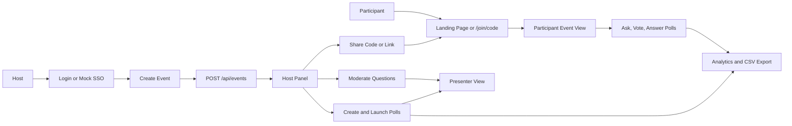

# CrowdPulse Project Features

## Executive Summary

CrowdPulse is an internal live audience-engagement platform for company meetings, all-hands, town halls, hackathons, onboarding sessions, and retrospectives. It lets a host create an event, share an access code or join link, collect audience questions, run live polls and quizzes, display results on a projector, and review engagement analytics after the session.

The project is implemented as a Next.js 16 application with React 19, TypeScript, Prisma, SQLite, NextAuth, and Socket.IO. Business data is stored in SQLite through Prisma models, while live room updates are broadcast with Socket.IO through a custom Node server.

The application implements most of the acceptance criteria from `../AcceptanceCritera.md`. The largest demo-oriented shortcuts are mocked SSO, local SQLite persistence, no event-close lifecycle before analytics, and a few UI gaps such as stored poll images not being rendered.

## Product Purpose

CrowdPulse solves a common meeting problem: participants want a low-friction way to ask questions and react live, while organizers need moderation, structured audience input, and a clean presenter display for the room.

The product supports four main user types:

- Host or organizer: creates events, configures rooms, moderates Q&A, launches polls, and reviews analytics.
- Participant: joins quickly by code or link, asks questions, upvotes, and answers polls or quizzes.
- Speaker or presenter: uses the projector view to show top questions, focused questions, poll results, and leaderboards.
- IT or administrator: expects access control through enterprise authentication. In the current hackathon implementation, this is represented by a mock SSO flow.

## Platform Flow



The main runtime loop is:

1. Hosts and participants use Next.js pages under `app/`.
2. Pages call REST-style route handlers under `app/api/`.
3. API routes persist durable changes through Prisma and SQLite.
4. After important writes, clients emit Socket.IO events.
5. `server.ts` broadcasts those events to all clients joined to the same event room.
6. Receiving clients update local React state or refetch the affected API endpoint.

## Business Features

### 1. Event Creation And Configuration

Business value: organizers can create a dedicated interaction space for a meeting and immediately receive an access code that participants can use without a complex onboarding flow.

User flow:

1. Host signs in at `/login` through credentials, registration, or mock company SSO.
2. Host opens `/create`.
3. Host enters event name, start date, end date, optional passcode, and the question moderation setting.
4. The page sends `POST /api/events`.
5. The backend creates the event, generates a unique access code, creates a default `Main` room, and redirects the host to `/event/[id]/host`.
6. The host copies the direct share link from the host panel.

Technical implementation:

- `app/create/page.tsx` renders the event creation form and calls the events API.
- `app/api/events/route.ts` validates the session, requires `session.user.role === "host"`, generates a unique access code, and creates the event.
- `lib/generate-code.ts` generates six-character codes using unambiguous uppercase letters and digits.
- `prisma/schema.prisma` stores event fields on the `Event` model and creates related rooms through the `Room` model.

Acceptance status: mostly implemented. The app supports event name, dates, passcode, moderation flag, access code, and share link. The access code format is `ABC123` style rather than a branded `#PROD2026` format, and moderation can be configured during creation but not toggled later from event settings.

### 2. Quick Join For Participants

Business value: participants can join a meeting interaction space quickly from a code or direct link, which reduces friction during live events.

User flow:

1. Participant enters an event code on `/` or opens `/join/[code]`.
2. If unauthenticated, the app asks for a display name and signs the user in through the guest provider.
3. If the event has a passcode, the participant enters it.
4. The app calls `POST /api/events/join`.
5. On success, the participant lands on `/event/[id]`.

Technical implementation:

- `app/page.tsx` handles the landing-page code entry flow.
- `app/join/[code]/page.tsx` handles direct links.
- `app/api/events/join/route.ts` looks up events by uppercase access code and checks the optional passcode.
- `lib/auth.ts` defines a `guest` credentials provider that creates a participant user with `isGuest: true`.

Acceptance status: mostly implemented. Join by code and direct link work, including optional passcode. The enterprise SSO name mapping is mocked rather than coming from a real corporate identity token.

### 3. Asking Questions And Voting

Business value: participants can surface the most important questions without interrupting the session, and leaders can prioritize answers by audience demand.

User flow:

1. Participant opens `/event/[id]`.
2. Participant selects a room if multiple rooms exist.
3. Participant writes a question with a maximum length of 300 characters.
4. Participant optionally checks "Ask anonymously".
5. The app posts the question to `POST /api/events/[id]/questions`.
6. The question appears immediately if moderation is disabled, or appears to its author as pending if moderation is enabled.
7. Participants upvote or remove their vote with the vote button.
8. The list is sorted by vote count.

Technical implementation:

- `app/event/[id]/page.tsx` renders the participant question form and vote controls.
- `app/api/events/[id]/questions/route.ts` validates content length, resolves the active room, stores the question, and returns author display metadata.
- `app/api/events/[id]/questions/[questionId]/vote/route.ts` toggles votes.
- `Vote` has a unique constraint on `(questionId, userId)`, so one user can only vote once per question.
- Socket event `question:new` broadcasts new questions, while `question:vote` broadcasts vote-count changes.

Acceptance status: implemented. The 300-character limit, anonymous option, one-vote toggle, and vote sorting are present.

### 4. Live Question Moderation

Business value: hosts can keep the shared screen useful and safe by controlling which questions become public and which one is currently being answered.

User flow:

1. Host enables moderation when creating the event.
2. Participant submits a question.
3. The question is stored as `pending`.
4. Host opens `/event/[id]/host` and reviews the `Review` tab.
5. Host approves or rejects pending questions.
6. Approved questions move into the live list.
7. Host can highlight a question to put the presenter view into focus mode.
8. Host can archive a question after it has been answered.

Technical implementation:

- `Question.status` supports `pending`, `approved`, `highlighted`, `archived`, and `rejected`.
- `app/event/[id]/host/page.tsx` renders `Live`, `Review`, `Archived`, and `Polls` tabs.
- `app/api/events/[id]/questions/pending/route.ts` lists pending questions for the event owner.
- `app/api/events/[id]/questions/[questionId]/moderate/route.ts` updates question status after verifying that the current user created the event.
- Socket event `question:status` tells participant and presenter views to update question state.

Acceptance status: implemented. Moderation, approve, reject, highlight, and archive flows are present.

### 5. Polls, Word Clouds, And Quizzes

Business value: hosts can turn one-way presentations into interactive moments and collect structured audience feedback.

User flow:

1. Host opens the `Polls` tab in `/event/[id]/host`.
2. Host creates a poll draft.
3. Host chooses `Multiple Choice`, `Word Cloud`, or `Quiz`.
4. For multiple-choice and quiz polls, the host enters answer options.
5. For quiz polls, the host marks the correct option and sets a timer.
6. The host optionally enters an image URL.
7. The poll is saved as `draft`.
8. Host clicks `Launch`.
9. The active poll appears for participants and on the presenter view.

Technical implementation:

- `Poll.type` stores `multiple_choice`, `word_cloud`, or `quiz`.
- `Poll.status` stores `draft`, `active`, or `closed`.
- `app/event/[id]/host/page.tsx` renders the poll creation and management UI.
- `app/api/events/[id]/polls/route.ts` lists and creates polls.
- `app/api/events/[id]/polls/[pollId]/correct/route.ts` stores a quiz correct answer.
- `app/api/events/[id]/polls/[pollId]/route.ts` updates poll status.
- When a poll is activated, the API closes other active polls in the same room.

Acceptance status: mostly implemented. Poll types, draft state, launch, one active poll per room, quiz correct answer, and image URL storage exist. Image URLs are stored but not rendered in participant or presenter views.

### 6. Real-Time Poll Participation

Business value: participants see live activities appear at the right moment without refreshing the page, which keeps the meeting flow smooth.

User flow:

1. Host launches a poll.
2. Host client emits `poll:activated`.
3. Socket.IO broadcasts the event to connected clients in the same event.
4. Participant view fetches the active poll.
5. Participant submits an answer.
6. The API records the response and prevents duplicate responses.
7. The participant sees a submitted state, quiz result, or rank depending on poll type.
8. Presenter view updates live result visualizations as responses arrive.

Technical implementation:

- `server.ts` creates a Socket.IO server at `/api/socketio`.
- `lib/socket.ts` exposes a singleton Socket.IO client.
- `app/event/[id]/page.tsx` listens for `poll:activated`, `poll:closed`, and `poll:response`.
- `app/api/events/[id]/polls/active/route.ts` returns the current active poll, response counts, and word-cloud aggregation.
- `app/api/events/[id]/polls/[pollId]/respond/route.ts` records participant responses.
- `PollResponse` has a unique constraint on `(pollId, userId)` to enforce one response per poll.

Acceptance status: mostly implemented. Live delivery and response capture work. Partial results are primarily shown in presenter view; participant view shows a submitted state for non-quiz polls rather than live partial results.

### 7. Projector And Presenter View

Business value: the audience can see a clean large-format display that focuses attention on the current interaction, top questions, results, or leaderboard.

User flow:

1. Host opens `/event/[id]/present`.
2. Presenter view joins the event socket room.
3. If no poll is active and no question is highlighted, it shows top questions.
4. If the host highlights a question, presenter view switches into focused question mode.
5. If a poll is active, it shows poll results as bars or word cloud.
6. If the host triggers a leaderboard, it shows top quiz scores.

Technical implementation:

- `app/event/[id]/present/page.tsx` renders the presenter experience.
- It fetches event details, questions, and the active poll for the selected room.
- It listens for `question:new`, `question:vote`, `question:status`, `poll:activated`, `poll:response`, `poll:closed`, and `poll:leaderboard`.
- Multiple-choice and quiz results are rendered as large bars.
- Word-cloud responses are aggregated by `app/api/events/[id]/polls/active/route.ts` and rendered as weighted words.

Acceptance status: mostly implemented. Presenter view is clean and optimized for large display, but it still has a slim header and optional room switcher. Automatic projector dark/light adjustment is represented by the theme system rather than automatic environment detection.

### 8. Quiz Gamification And Leaderboard

Business value: quizzes increase engagement by rewarding both correctness and speed, then turning results into friendly competition.

User flow:

1. Host creates a quiz and sets a timer.
2. Host marks the correct answer.
3. Host launches the quiz.
4. Participant sees a countdown and answer options.
5. Participant answers before the timer ends.
6. Backend calculates score.
7. Participant sees whether the answer was correct and how many points were earned.
8. Participant can see current rank after answer submission.
9. Host closes the quiz and clicks `Leaderboard`.
10. Presenter view displays ranked participants.

Technical implementation:

- `Poll.timerSeconds` stores the quiz duration.
- Participant timer state is handled in `app/event/[id]/page.tsx`.
- `app/api/events/[id]/polls/[pollId]/respond/route.ts` calculates score server-side.
- Correct answers score from 500 to 1000 points based on remaining time.
- Incorrect answers score 0.
- `app/api/events/[id]/polls/[pollId]/leaderboard/route.ts` aggregates cumulative quiz scores by user across quiz polls in the selected room.
- Socket event `poll:leaderboard` pushes leaderboard state to the presenter view.

Scoring formula:

```text
score = 500 + (timeRemainingMs / totalMs) * 500
```

Acceptance status: mostly implemented. Scoring and leaderboard are implemented. Participants only see score/rank after submitting; timer expiry alone does not automatically reveal the correct answer or assign a visible result.

### 9. Multi-Room Support

Business value: one large event can contain parallel tracks or breakout sessions while preserving a single access code.

User flow:

1. Event creation automatically creates a `Main` room.
2. Host uses the room switcher on the host panel.
3. Host can create additional rooms.
4. Host, participant, presenter, and analytics views select the active room.
5. Questions and polls are scoped to the selected room.

Technical implementation:

- `Room` belongs to `Event`.
- `Question` and `Poll` belong to `Room`, not directly to `Event`.
- `components/room-switcher.tsx` renders room tabs and optional room creation.
- `app/api/events/[id]/rooms/route.ts` lists and creates rooms.
- Pages pass `roomId` as a query parameter to question, poll, leaderboard, and analytics APIs.
- Poll activation closes active polls only within the same room.

Acceptance status: implemented. Room switching and isolation for Q&A, polls, presenter data, and analytics are present. Socket broadcasts are event-wide, but clients filter or refetch room-scoped data.

### 10. Analytics Dashboard And CSV Export

Business value: organizers can review meeting engagement and export raw data for follow-up analysis.

User flow:

1. Host opens `/event/[id]/analytics`.
2. Host selects a room if multiple rooms exist.
3. Dashboard shows participant count, question count, question upvotes, poll responses, and engagement rate.
4. Host clicks `Export to CSV`.
5. Browser downloads a CSV containing questions and poll results.

Technical implementation:

- `app/event/[id]/analytics/page.tsx` renders analytics cards, poll summaries, all questions, and CSV export.
- `app/api/events/[id]/analytics/route.ts` computes metrics from questions, votes, polls, and responses.
- Participants are counted from unique question authors and poll responders.
- CSV generation happens client-side through a `Blob` and temporary object URL.

Acceptance status: mostly implemented. Metrics and CSV export work. There is no event close flow, so analytics are always reachable. The UI separates question upvotes and poll responses instead of exposing one combined "total votes cast" metric.

### 11. Enterprise SSO Authentication Security

Business value: internal meeting tools should restrict event creation and participation to authorized company users.

User flow:

1. User opens `/login`.
2. User can sign in with credentials, register, or use the mock SSO form.
3. Mock SSO accepts a corporate email-like input.
4. The backend finds or creates a host user for that email.
5. Session data includes user id and role.

Technical implementation:

- `lib/auth.ts` configures NextAuth providers.
- `lib/sso.ts` derives a display name from the email local part.
- `types/next-auth.d.ts` extends session and token typing for `id` and `role`.
- `app/api/auth/register/route.ts` creates registered host users and hashes passwords with bcrypt.
- `app/api/events/route.ts` requires a `host` role for event creation.

Acceptance status: partial. The project has a stable mock SSO path suitable for hackathon purposes, but it does not implement real OAuth2, Azure AD, corporate redirects, domain allow-listing, or route-level enterprise access enforcement. Guest participants can join without SSO.

## Technical Architecture

### Frontend

The frontend uses Next.js App Router pages under `app/`. Most screens are client components using React local state, `useEffect`, and `fetch`. There is no global state library. Each page owns its own loading, selected room, question, poll, and form state.

Important page routes:

- `/`: landing page and join-by-code flow.
- `/login`: sign in, registration, and mock SSO.
- `/create`: event creation.
- `/join/[code]`: direct access-code join flow.
- `/event/[id]`: participant experience.
- `/event/[id]/host`: host panel.
- `/event/[id]/present`: projector view.
- `/event/[id]/analytics`: analytics dashboard.

### Backend APIs

Next.js route handlers under `app/api/` provide the durable backend. They validate sessions where needed, read or write through Prisma, and return JSON responses. Realtime broadcasting is not done by the API routes directly; instead, after API calls succeed, clients emit Socket.IO events.

### Persistence

The database layer uses Prisma 7 with SQLite and `@prisma/adapter-better-sqlite3`.

- `lib/db.ts` creates a Prisma client using `DATABASE_URL` or `file:./prisma/dev.db`.
- `prisma/schema.prisma` defines users, events, rooms, questions, votes, polls, options, and poll responses.
- Migrations are stored under `prisma/migrations/`.

### Realtime

`server.ts` wraps Next.js with a custom HTTP server and attaches Socket.IO. Clients connect to `/api/socketio` using `lib/socket.ts`.

Socket.IO is used as a fan-out layer:

- It does not persist data.
- It does not calculate business rules.
- It broadcasts event notifications.
- Clients then update local state or refetch the relevant REST endpoint.

### Theming And Visual Skins

The UI includes three visual skins: `loom`, `arcade`, and `press`.

- `app/globals.css` defines CSS variables for each skin.
- `components/theme-provider.tsx` stores the selected theme in `localStorage` under `crowd-pulse-theme`.
- `components/skin-switcher.tsx` lets users switch skins.
- `components/app-header.tsx` uses the same visual tokens for consistent branding.

This system came from the original `../Loom-SPEC.md` design direction and is now applied to the CrowdPulse product UI.

## Data Model

### User

Represents a person using the app. Users can be guests, credential users, or mock SSO users. `role` controls whether a user can create events.

Key fields:

- `displayName`
- `email`
- `password`
- `role`
- `isGuest`

### Event

Represents a live meeting or session. Events are created by hosts and contain one or more rooms.

Key fields:

- `name`
- `startDate`
- `endDate`
- `accessCode`
- `passcode`
- `moderationEnabled`
- `createdBy`

### Room

Represents a track or breakout area inside an event. Rooms isolate questions and polls.

Key fields:

- `eventId`
- `name`

### Question

Represents participant-submitted Q&A content.

Key fields:

- `roomId`
- `authorId`
- `content`
- `isAnonymous`
- `status`

### Vote

Represents a question upvote by a user. The unique `(questionId, userId)` constraint enforces one vote per user per question.

Key fields:

- `questionId`
- `userId`

### Poll

Represents a multiple-choice poll, word cloud, or quiz.

Key fields:

- `roomId`
- `title`
- `type`
- `imageUrl`
- `status`
- `correctAnswer`
- `timerSeconds`

### PollOption

Represents selectable options for multiple-choice polls and quizzes.

Key fields:

- `pollId`
- `text`
- `order`

### PollResponse

Represents one participant response to a poll. For quizzes, it also stores the awarded score. The unique `(pollId, userId)` constraint enforces one response per user per poll.

Key fields:

- `pollId`
- `optionId`
- `userId`
- `textValue`
- `answeredAt`
- `score`

## API Route Map

### Auth

- `app/api/auth/[...nextauth]/route.ts`: NextAuth route handler.
- `app/api/auth/register/route.ts`: creates email/password host accounts.

### Events

- `app/api/events/route.ts`: creates and lists events for the current host.
- `app/api/events/join/route.ts`: validates access code and optional passcode.
- `app/api/events/[id]/route.ts`: returns event details, rooms, and host display name.

### Rooms

- `app/api/events/[id]/rooms/route.ts`: lists rooms and creates new rooms.

### Questions

- `app/api/events/[id]/questions/route.ts`: lists visible questions and creates new questions.
- `app/api/events/[id]/questions/pending/route.ts`: lists pending questions for the event owner.
- `app/api/events/[id]/questions/[questionId]/vote/route.ts`: toggles a user's vote.
- `app/api/events/[id]/questions/[questionId]/moderate/route.ts`: approves, rejects, highlights, archives, or resets question status.

### Polls And Quizzes

- `app/api/events/[id]/polls/route.ts`: lists and creates polls.
- `app/api/events/[id]/polls/active/route.ts`: returns the active poll for a room with response counts or word-cloud entries.
- `app/api/events/[id]/polls/[pollId]/route.ts`: changes poll status between draft, active, and closed.
- `app/api/events/[id]/polls/[pollId]/correct/route.ts`: sets the correct quiz answer.
- `app/api/events/[id]/polls/[pollId]/respond/route.ts`: records a participant response and computes quiz score.
- `app/api/events/[id]/polls/[pollId]/leaderboard/route.ts`: returns cumulative quiz leaderboard results.

### Analytics

- `app/api/events/[id]/analytics/route.ts`: returns room-scoped metrics, questions, and poll result summaries.

## Realtime Event Map

Socket clients join event-scoped rooms using `join-event`. The server maps that to Socket.IO room `event:{eventId}`.

| Client event | Server broadcast | Purpose |
| --- | --- | --- |
| `join-event` | none | Adds client to an event socket room. |
| `leave-event` | none | Removes client from an event socket room. |
| `question:new` | `question:new` | Notifies clients that a question was submitted. |
| `question:vote` | `question:vote` | Notifies clients that a vote count changed. |
| `question:status` | `question:status` | Notifies clients that moderation changed a question. |
| `poll:activated` | `poll:activated` | Notifies clients that a poll became active. |
| `poll:response` | `poll:response` | Notifies clients that poll results changed. |
| `poll:closed` | `poll:closed` | Notifies clients that a poll closed. |
| `poll:leaderboard` | `poll:leaderboard` | Pushes leaderboard data to presenter view. |

Most payloads include `eventId`, and many include `roomId`. The socket room itself is event-scoped, while API calls and UI state are room-scoped.

## Security And Authorization

Implemented protections:

- Event creation requires an authenticated user.
- Event creation requires `session.user.role === "host"`.
- Pending-question review checks that the session user created the event.
- Question moderation checks that the session user created the event.
- Question creation requires an authenticated session, including guest sessions.
- Vote creation requires an authenticated session.
- Poll responses require an authenticated session.
- Password registration uses bcrypt hashing.
- NextAuth sessions use JWT strategy.

Important gaps:

- Mock SSO does not perform real OAuth, Azure AD, domain restriction, or redirect-based login.
- Guest participants can join events without corporate SSO.
- `/event/[id]/host`, `/event/[id]/present`, and `/event/[id]/analytics` are not protected by server-side page authorization.
- Room creation accepts any authenticated user and does not verify event ownership.
- Poll creation, poll status updates, and correct-answer updates should verify that the current user owns the event.
- `app/api/events/[id]/polls/[pollId]/correct/route.ts` does not currently require authentication.
- Join passcodes are stored as plain text.
- Socket events rely on client-emitted notifications and do not independently authorize event membership.

## Known Limitations And Demo Gaps

- SSO is intentionally mocked with an email-based provider.
- The app uses local SQLite, which is appropriate for a hackathon demo but not for multi-instance production deployment.
- There is no event lifecycle state such as draft, live, closed, or archived.
- Analytics are always accessible by route rather than only after closing an event.
- Poll image URLs are stored but not rendered in participant or presenter views.
- Participant view does not show live partial results after non-quiz poll submission.
- Quiz timer expiry disables submission but does not automatically reveal the correct answer to users who did not answer.
- Presenter view is clean but not completely chrome-free because it keeps a header and room switcher.
- Access codes are six-character codes without a `#` prefix or event-name branding.
- The moderation setting is only configured during event creation.
- The original Loom spec included a live pulse interaction, but this is not implemented in the acceptance-criteria MVP.

## Suggested Next Improvements

1. Replace mock SSO with real Azure AD or OAuth2 and enforce a company domain allow-list.
2. Add middleware or server-side checks for host, analytics, and presenter routes.
3. Tighten ownership checks for rooms, polls, poll status changes, and correct-answer updates.
4. Add an event lifecycle so analytics become available after an event is closed.
5. Render poll images in participant and presenter views.
6. Improve quiz timeout behavior so unanswered participants see the correct answer and a zero-score result.
7. Add a durable room-level theme setting so hosts can choose a visual skin per event or room.
8. Add production-ready persistence such as Postgres and adjust Socket.IO scaling for multi-instance deployments.
9. Add tests for authorization, one-vote constraints, one-response constraints, poll activation, and quiz scoring.
10. Add CSV export coverage for individual poll responses and quiz scores if deeper post-event analysis is required.

## Quick Reference

Run the app from `ctrl-wroclaw-hackdays`:

```bash
npm install
npm run dev
```

Use `npm run dev`, not only `npm run dev:next`, because the main development command starts `server.ts`, which includes both Next.js and Socket.IO.

